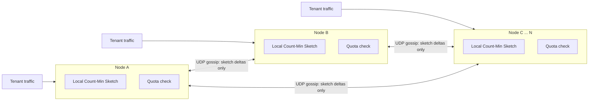

# EdgeQuota

**Decentralized, cost-aware rate limiter for multi-region API gateways.**
No coordinator on the request path: per-tenant quotas are enforced using a
Count-Min Sketch built from scratch, kept approximately in sync across
nodes via a SWIM-inspired gossip protocol, with a provable hard cap on
worst-case cluster-wide overshoot.



Each node decides admit/reject entirely on its own. The only thing that
crosses the network between nodes is small aggregate sketch deltas —
never raw request logs, and never a synchronous call on the request
path.

## Why this exists

Centralized (Redis-style) rate limiters put a synchronous RPC on every
request's critical path and turn the limiter store into a single point of
failure. EdgeQuota's bet: make every admit/reject decision purely local,
using a background-gossiped *approximate* view of cluster-wide usage
instead of a synchronous, authoritative one. See
[`docs/DESIGN.md`](docs/DESIGN.md) for the full argument, including the
Count-Min Sketch error-bound derivation and the two-mechanism (soft local
budget + hard global safety valve) quota adjustment design.

## What's actually in here

- **`sketch/`** -- `CountMinSketch` (weighted, mergeable, from-scratch
  Murmur3-based hashing, zero dependencies) and `ConservativeCountMinSketch`
  (Estan & Varghese conservative-update variant, tighter empirical bound).
- **`gossip/`** -- SWIM-inspired failure detection (ping / indirect-ping /
  suspicion / dead) and epidemic rumor-mongering dissemination of sketch
  deltas, over a hand-rolled `java.nio` UDP reactor (`GossipTransport`).
- **`quota/`** -- `QuotaAdjustmentAlgorithm` (smoothed local budget,
  clamped share) and `QuotaManager` (the hard global safety valve that
  actually bounds worst-case overshoot).
- **`cost/`** -- `CostEstimator`: turns a request into a weighted cost from
  token count, GraphQL query complexity (hand-rolled heuristic scanner, no
  parser dependency), and request byte size.
- **`gateway/`** + **`node/`** -- an HTTP gateway (`java.nio` accept
  reactor + worker pool) and process bootstrap wiring it all together.
- **`sim/SimulationRunner`** -- an in-process, real-socket multi-node
  cluster harness that produces the benchmark numbers in
  [`docs/BENCHMARKS.md`](docs/BENCHMARKS.md).
- **`docker-compose.yml`** + **`scripts/`** -- a real 5-container cluster,
  plus load-test and fault-injection (`docker stop`, network partition)
  scripts.

## Quickstart

```bash
# Run the full test suite (JUnit5, real UDP sockets for the gossip tests)
mvn test

# Run the benchmark/simulation harness (no Docker needed)
./scripts/run-simulation.sh

# Bring up a real 5-node cluster
docker compose up --build

# In another terminal: load-test it and watch cluster-wide (not per-node) quota enforcement
./scripts/load-test.sh

# Kill/partition a node and watch the cluster degrade gracefully
./scripts/fault-injection.sh both
```

No Maven or Docker locally? `./scripts/build-without-maven.sh` compiles the
(dependency-free) main sources with plain `javac`.

## Why no Netty

This project's HTTP and gossip transports are hand-rolled `java.nio`
reactors rather than Netty. That's a deliberate trade, not a limitation --
see [`docs/DESIGN.md`](docs/DESIGN.md#5-netty-vs-hand-rolled-reactor)
for the reasoning: it keeps the whole thing dependency-free and end-to-end
auditable, and demonstrates the event-loop mechanics Netty is built on
rather than treating them as a black box. Swapping in real Netty is a
localized change at the `RateLimitHandler`/`HttpRequest` boundary.

## Design docs

- [`docs/DESIGN.md`](docs/DESIGN.md) -- the Count-Min Sketch error-bound
  proof, the SWIM/gossip design and its `O(log n)` convergence argument,
  and the two-mechanism quota-overshoot bound.
- [`docs/BENCHMARKS.md`](docs/BENCHMARKS.md) -- measured CMS accuracy,
  gossip convergence rounds vs. cluster size, and what each JUnit test
  actually pins down.

## License

MIT, see [`LICENSE`](LICENSE).
